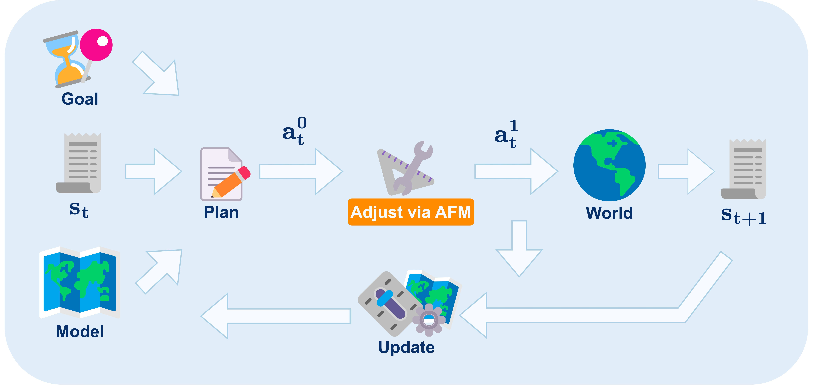

# Action Flow Matching (AFM)

Code for the paper **"Action Flow Matching for Continual Robot Learning"** presented at Robotics: Science and Systems (RSS) 2025.

[](https://roboticsconference.org/program/papers/26/)
[](https://arxiv.org/abs/2504.18471)
[](https://huggingface.co/AlejandroMllo/action_flow_matching)




AFM enables efficient, non-episodic, online robot model refinement. AFM adjusts the planned actions seeking to reduce the gap between the intended and realized/actual state transitions.

---

## Table of Contents

* [Installation](#installation)

  * [Conda Environment Setup](#conda-environment-setup)
  * [Dependencies](#dependencies)

* [Data and Pre-trained Weights](#data-and-pre-trained-weights)


* [Experiment Execution](#experiment-execution)


* [Citation](#citation)

* [Contact](#contact)

---

## Installation

### Clone the Repository

Before setting up the environment, clone this repository and navigate to the root directory:

```bash
git clone https://github.com/AlejandroMllo/action_flow_matching.git
cd action_flow_matching
```

### Conda Environment Setup

We recommend creating a dedicated Conda environment for this project.

1. **Create the environment:**

   ```bash
   conda create -n afm python=3.10.16 -y
   ```

2. **Activate the environment:**

   ```bash
   conda activate afm
   ```

### Dependencies

Install required Python packages:

```bash
pip install -r requirements.txt
```

---

## Data and Pre-trained Weights

All required datasets and pre-trained model weights are hosted on Hugging Face (https://huggingface.co/AlejandroMllo/action_flow_matching):

1. **Install Hugging Face Hub CLI:**

   ```bash
   pip install huggingface_hub
   ```

2. **Download Models:** From the project's root, type: 

   ```bash
   hf download AlejandroMllo/action_flow_matching --exclude data/* --local-dir .
   ```

3. **[Optional] Download Dataset:**

   ```bash
   hf download AlejandroMllo/action_flow_matching --exclude artifacts/* --local-dir .
   ```

After downloading the pretrained checkpoints and (optionally) the datasets, your project root should look like:

```
.
├── .git/
├── .gitignore
├── README.md
├── artifacts/
│   └── ugv/
│       ├── afm/
│       │   └── latest_model.pth
│       └── dynamics/
│           ├── model_0
│           ├── model_1
│           ├── model_2
│           ├── model_3
│           └── model_4
├── assets/
├── data/
│   └── ugv/
│       ├── afm_data_dubins.pt
│       ├── ugv_transition_dynamics_delta.csv
│       └── ugv_transition_dynamics_val_delta.csv
├── requirements.txt
├── results/         # If you already have any
└── src/
```

---

## Experiment Execution

Run the experiments from the `continual_dynamics_learning.py` script (note that you need to navigate to `/src`):

```bash
cd src/
python continual_dynamics_learning.py
```
The results will be automatically saved at the same level of the `/src` directory in the `/results` folder.

## Citation

If you use this code, please cite our paper:

```bibtex
@article{murillogonzalez2025afm,
  title={Action Flow Matching for Continual Robot Learning},
  author={Murillo-Gonzalez, Alejandro and Liu, Lantao},
  journal={Robotics: Science and Systems (RSS)},
  year={2025}
}
```

## Contact

For questions or issues, please contact:

* Alejandro Murillo-Gonzalez: [almuri@iu.edu](mailto:almuri@iu.edu)

Feel free to open GitHub issues or pull requests for contributions.
